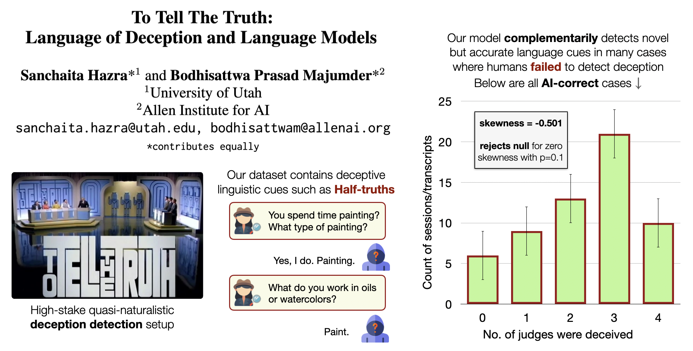

# To Tell the Truth from Text

Official repository for the paper [To Tell The Truth: Language of Deception and Language Models](https://arxiv.org/pdf/2311.07092.pdf)

A sample transcript from our dataset is available [here](https://github.com/sanchaitahazra/T4Text/blob/main/T5/sample_72.txt). To access the full dataset, please fill up the [form](https://forms.gle/4r45bFvWCcp8jazz9). We will share the dataset shortly after the request is submitted. 

The dataset is released under ODC-BY license. You are only allowed to use this for research purposes.

<p align="center">
  <a href="[https://github.com/sanchaitahazra/T4Text](https://github.com/sanchaitahazra/T4Text)">
    
  </a>
</p>


## Citation
```bib
@inproceedings{hazra2024t4text,
  author    = "Hazra, Sanchaita and Majumder, Bodhisattwa Prasad",
  title     = "To Tell The Truth: Language of Deception and Language Models",
  booktitle = "Proceedings of the 2024 Conference of the North American Chapter of the Association for Computational Linguistics: Human Language Technologies (NAACL-HLT)",
  year = "2024",
  pages = "8498--8512",
  publisher = "Association for Computational Linguistics",
  url = "https://aclanthology.org/2024.naacl-long.470"
}
```
